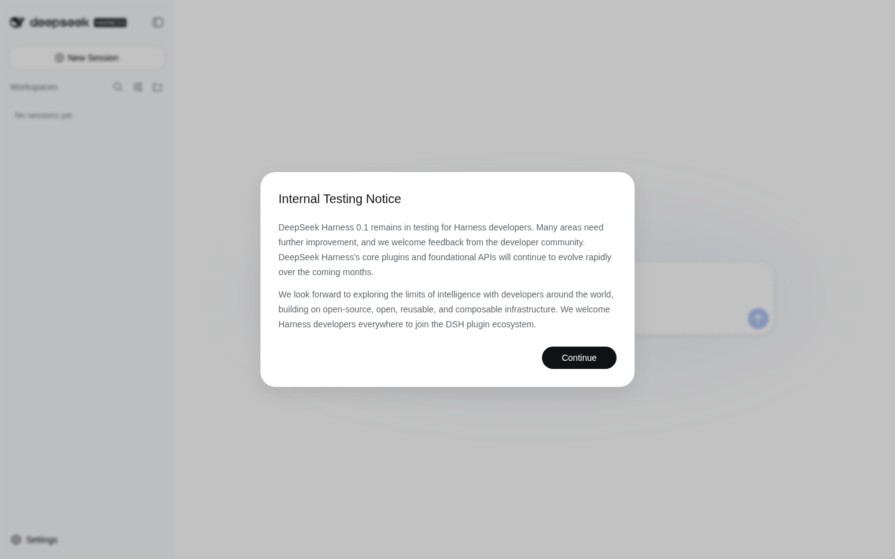

# deep-seek-harness

Local launcher for [DeepSeek Harness](https://github.com/deepseek-ai/deepseek-harness) (`dsh`) — DeepSeek's open-source agent harness with a browser Web UI.

Run one command on your machine and your browser opens the harness at **http://127.0.0.1:3080**.



> DeepSeek Harness is in _developer preview_ and changes fast. This repo pins the version it was last verified against (`@deepseek-ai/dsh@0.1.1-rc.2`); see [Updating](#updating) to move to the latest release.

## Requirements

- **Node.js 22.19+ or 24+** — check with `node --version`, install from [nodejs.org](https://nodejs.org/)
- A [DeepSeek API key](https://platform.deepseek.com/) (entered in the Web UI on first run)

## Quick start

From the directory you want the agent to work in (that directory becomes the default workspace root):

macOS / Linux:

```sh
./start-harness.sh
```

Windows:

```bat
start-harness.cmd
```

Both scripts run the pinned harness release, preferring pnpm when it is installed:

```sh
pnpm dlx @deepseek-ai/dsh@0.1.1-rc.2 web    # what the scripts run when pnpm exists
npx  -y @deepseek-ai/dsh@0.1.1-rc.2 web     # fallback otherwise (see Troubleshooting)
```

The command downloads the harness on first use (it is large — the first run takes a few minutes), starts the Web UI server, prints its URL, and opens **http://127.0.0.1:3080** in your default browser. Pass `--no-open` to skip the browser handoff. Stop the server with `Ctrl+C`.

Alternatively, with the pinned dependency in this repo:

```sh
pnpm install    # npm works too, but see Troubleshooting about npm's resolver
pnpm start      # runs: dsh web
```

This setup was verified end-to-end on a clean Linux container (Node v22.22, pnpm 10.33): `pnpm dlx @deepseek-ai/dsh@0.1.1-rc.2 web --no-open` served the Web UI at http://127.0.0.1:3080 (HTTP 200, app renders).

## First run: configure the Web UI

1. **Add your API key** — open **Settings → Models**, paste your [DeepSeek API key](https://platform.deepseek.com/), and save. It takes effect without restarting the server. Other providers and custom OpenAI-compatible endpoints are covered in the [upstream model guide](https://github.com/deepseek-ai/deepseek-harness/blob/master/docs/user/guide/providers.md).
   - Instead of the UI, you can put the key in a `.env` file next to where you launch: `cp .env.example .env`, then fill in `DEEPSEEK_API_KEY`.
2. **Choose a workspace** — click **Choose workspace**, add the project directory where you started `dsh`, and select it. The session composer stays disabled until a workspace is selected.
3. **Run a task** — start a session and try: _"Summarize this repository and identify its main packages."_ The agent can read and edit workspace files, run commands, and maintain a plan; it asks before operations that need approval under the active permission policy.

Full guide: [upstream Web UI docs](https://github.com/deepseek-ai/deepseek-harness/blob/master/docs/user/guide/index.md).

## Useful flags

Flags go after `web` (with the launcher scripts, just append them):

| Flag | Effect |
|---|---|
| `--port <n>` | Serve on another port (default `3080`) |
| `--no-open` | Don't open the browser automatically |
| `--trusted-host <authority>` | Accept requests with this `Host` (repeatable; for reverse-proxy / named-host setups) |
| `--help` | The web app's own help |

Example: `./start-harness.sh --port 4000 --no-open`

## Remote machines (SSH)

The server binds loopback (`127.0.0.1`) only, on purpose. If the harness runs on a remote box, forward the port and use your local browser:

```sh
ssh -L 3080:127.0.0.1:3080 user@remote-host
```

Then open http://127.0.0.1:3080 locally. When launched inside an SSH session, `dsh` detects it and only prints the URL instead of trying to open a browser.

## Security notes

- The Web UI has **no authentication**, and its API drives an agent that can execute shell commands in your workspace. Keep it on `127.0.0.1` (the default) and **never expose it through a public tunnel** (ngrok, cloudflared, a reverse proxy on a public interface, …). The CLI itself refuses `--host 0.0.0.0` for exactly this reason ("it would expose remote code execution to the network").
- SSH port-forwarding (above) is the supported way to use it from another machine.

## Run from source (advanced)

To hack on the harness itself (needs Node 22.19+/24+ and pnpm 11.7, e.g. via `corepack enable`):

```sh
git clone https://github.com/deepseek-ai/deepseek-harness.git
cd deepseek-harness
pnpm install
pnpm run build
pnpm dsh web
```

## Updating

The pin lives in two places: `DSH_VERSION` inside the launcher scripts (override per-run with the `DSH_VERSION` environment variable) and the dependency in `package.json`. To try the latest release without editing anything:

```sh
DSH_VERSION=latest ./start-harness.sh
```

## Troubleshooting

- **`npx`/`npm install` hangs on "resolving dependencies"** — npm's resolver (observed with npm 10.x) can grind for a very long time on this package's large `-rc` dependency graph, while pnpm resolves it in seconds. Install pnpm (`npm i -g pnpm` or `corepack enable pnpm`) and rerun the launcher script — it picks pnpm up automatically — or run `pnpm dlx @deepseek-ai/dsh@0.1.1-rc.2 web` directly.
- **First run feels slow even with pnpm** — the package tree is big; give it a few minutes. Later starts use the cache and are quick.
- **Port already in use** — pass `--port <n>`, e.g. `./start-harness.sh --port 3081`.
- **Behind a corporate proxy** — set `HTTPS_PROXY`, and `NODE_USE_ENV_PROXY=1` so Node honors it.
- **Browser didn't open** — the server keeps running; open the printed URL (http://127.0.0.1:3080) yourself.
